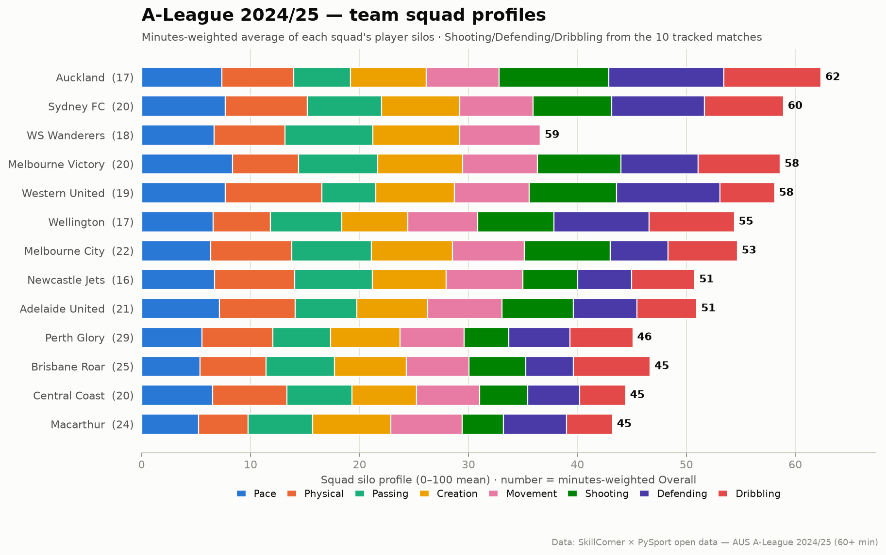
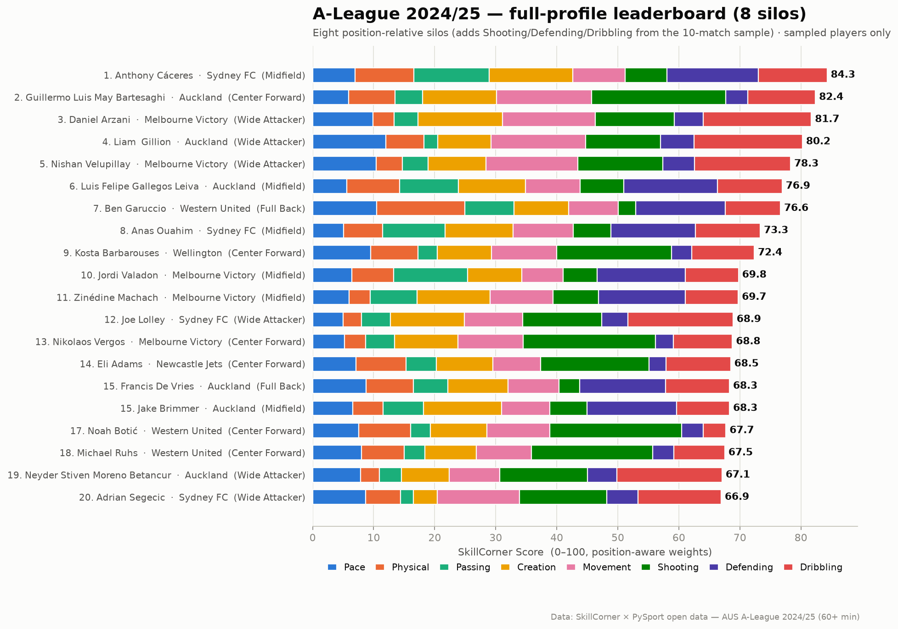
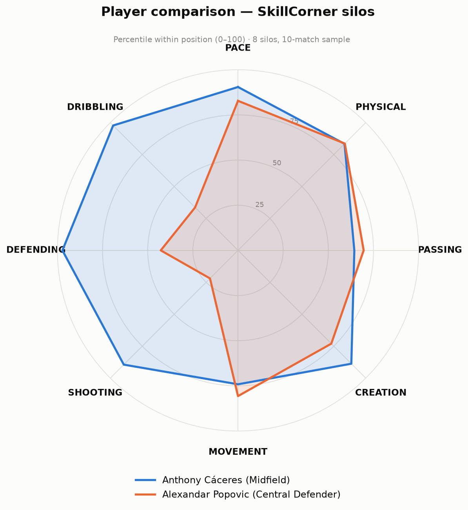
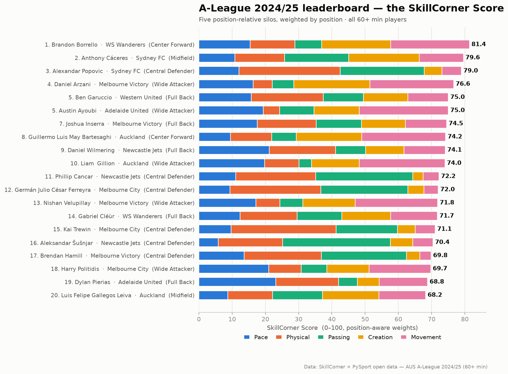
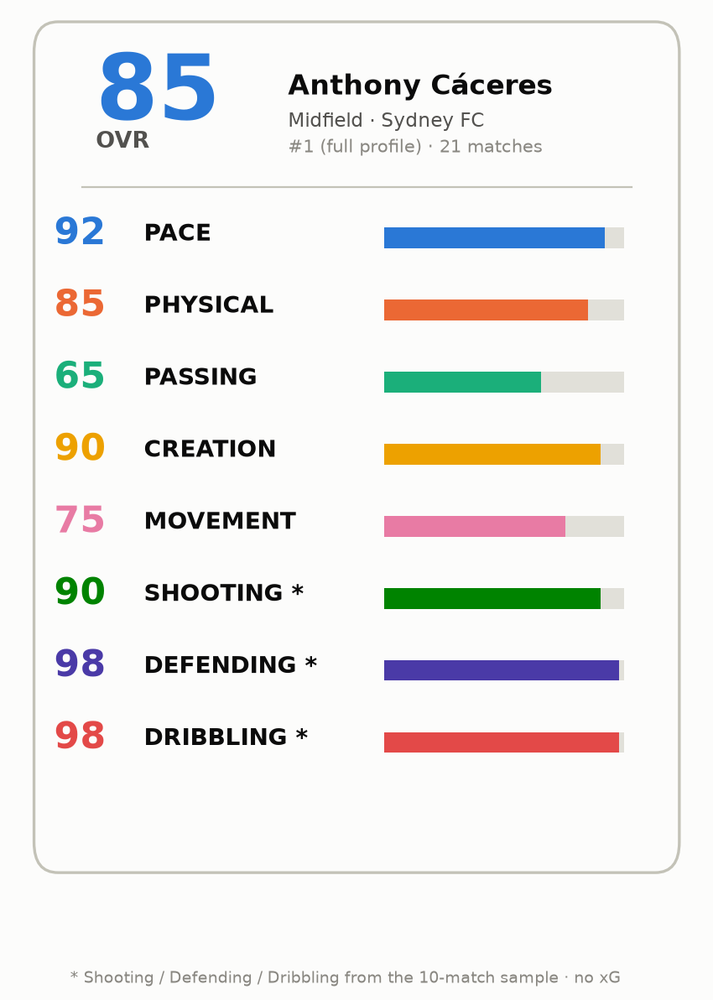
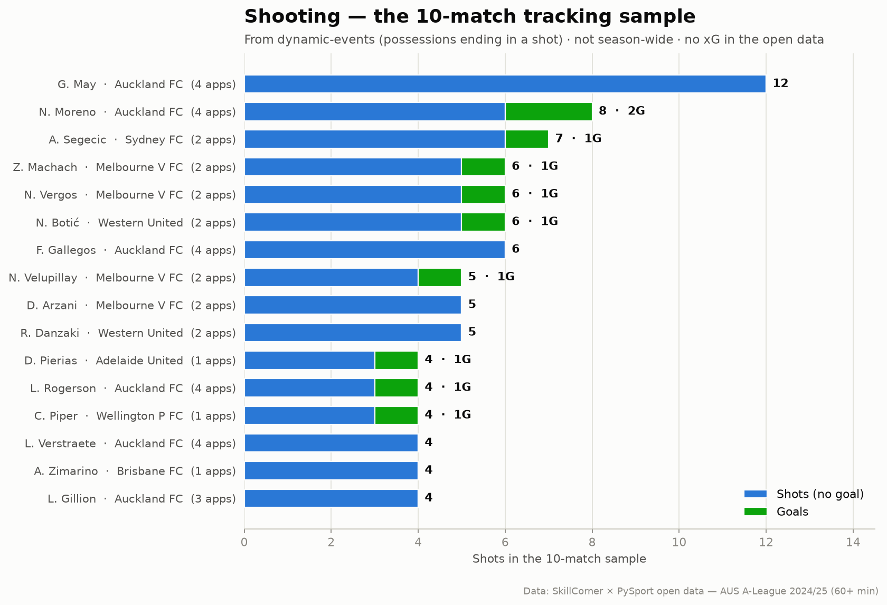
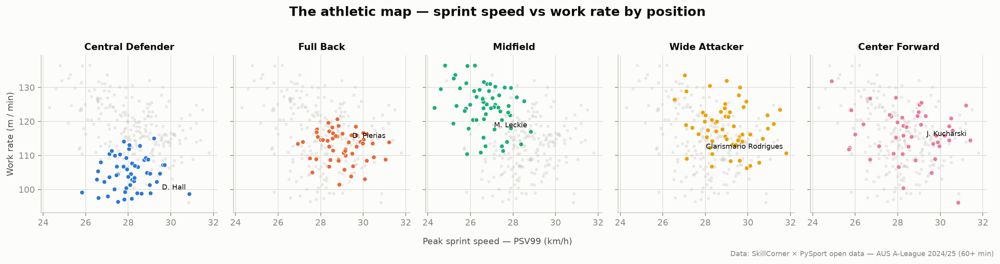
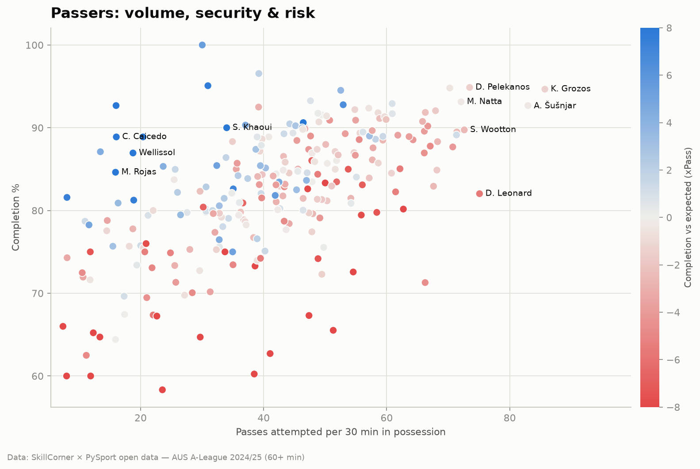
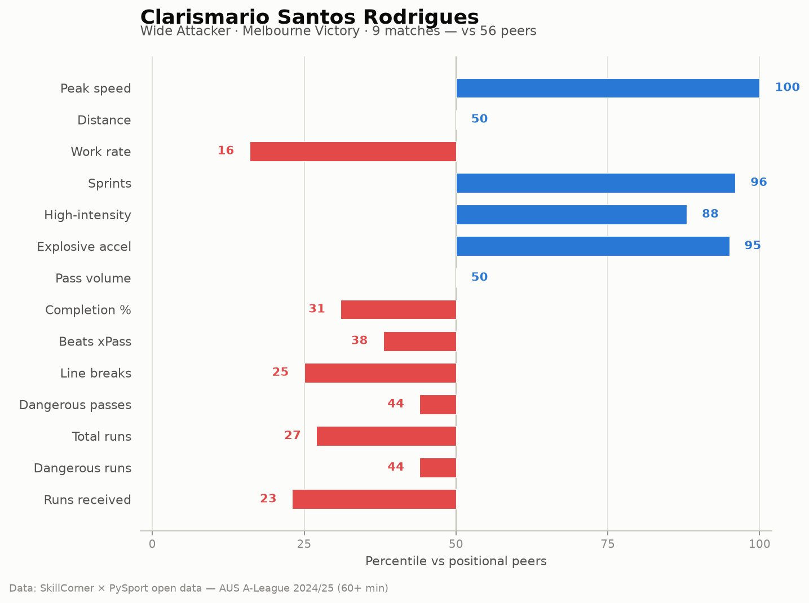

# 🏆 A-League 2024/25 — Season Explorer

⬅️ [Back to src README](../../README.md)

A set of visualizations built on the **season aggregates** (`data/aggregates/`) —
the Physical, Passing and Off-Ball-Run metrics for every A-League 2024/25 player
with **60+ minutes**. The three files are merged into one row per player (shown in
their primary position), giving a clean **268-player** dataset.

There are two deliverables:

1. **`season_dashboard.html`** — a single, self-contained interactive dashboard
   (no build step, no network calls; just open it in a browser). Filter by
   position, search any player, sort tables, re-weight the leaderboard, and hover
   every mark.
2. **Static PNG figures** in [`assets/viz/`](../../../assets/viz/) — the
   print/README companions below.

---

## 🏅 The SkillCorner Score — a FIFA-style rating

A single **0–100** rating per player so you can rank the league, built like a FIFA
card but **only from the faces broadcast tracking data can actually see**.

**What the data supports (five silos):**

| Silo | ~ FIFA face | Built from |
|---|---|---|
| **Pace** | PAC | peak sprint speed (PSV99), sprint volume, explosive accelerations |
| **Physical** | PHY | distance, work rate, high-intensity volume, high-speed running, braking |
| **Passing** | PAS | beating xPass, completion %, volume, range |
| **Creation** | *vision* | dangerous & line-breaking passes, passes into shots/runs |
| **Movement** | *(FIFA has none)* | dangerous off-ball runs, runs received, runs into shots/box |
| **Shooting** † | SHO | **shot value** = `shots + 3·goals` (sample totals) |
| **Defending** † | DEF | `2·regains + disruptions + 0.5·pressures` (sample totals) |
| **Dribbling** † | DRI | 1v1 **take-ons** — defenders beaten by the dribble (sample totals) |

† 10-match sample only (~155 players). Unlike the season silos, the three sample silos
are **volume totals** ranked **league-wide** (not per-appearance rates, and not
within-position). This is deliberate — see below.

**All eight silos, always.** The first five come from the *all-games* aggregates
(percentiled within position); the three sample silos come from the per-match **dynamic
events** in the 10 tracked matches (volume totals, percentiled league-wide). They are all
factored into every ranking — there is no toggle — so the leaderboard covers the **155
players** who feature in the tracked matches. (A separate 5-silo, all-220-player export
lives in `season_leaderboard.csv` for reference.) There is **no per-shot xG** in the data
(the events carry an expected-*shot* value, but only on defensive engagements, not on the
shots themselves), so Shooting is still built from volume and goals.

**Percentiles use the Weibull plotting position** `rank / (n + 1)`, so the best player in
a sample sits just under 100 (≈ 99) rather than exactly 100 — a sample's top isn't claimed
to beat 100% of a larger population — and the worst sits just above 0.

**The player card's OVR is always the position-weighted total** across all eight silos,
independent of whichever archetype preset the leaderboard is set to (so it never shows a
single silo's number as the overall).

**A per-graph Players / Teams view toggle.** Every graph — leaderboard, athletic &
passing maps, shooting, run-mix, the profile card, the comparison radar, the scatter
explorer and the heat-maps — carries its **own** Players/Teams segmented control, so each
can be switched independently (e.g. rank the *teams* on the leaderboard while keeping the
athletic map on *players*). A team is the **minutes-weighted average** of its players' silo
scores (season silos) and the summed event totals (sample silos), on the same 0–100 scale,
with a minutes-weighted Overall. Team ranks/percentiles are computed against the other
clubs. Exported to `team_leaderboard.csv`; a static `team_profile.png` is in `assets/viz/`.

### Deconstruct every silo — find your own nuggets

The eight silos are summaries; underneath them the pipeline now extracts **80+ metrics**
(a machine-readable *metric registry* travels in the data), so you can take any silo apart
and go looking for your own patterns. Three tools do this:

- **Silo drill-down (player card).** Click any silo face and it expands into a **grid of
  small cards, one per metric** behind that silo — the ones that build the score (marked
  with their `×weight`, or a `✓` for the single-composite sample silos) **and** a wider set
  of exploratory measures. Each card shows the player's value, a good-oriented percentile,
  and a **mini histogram** of the peer distribution with the player marked, so you see where
  they sit, not just a number.
- **Scatter explorer.** Pick one **focus metric** and a **comparison group** (a silo, or a
  headline set spanning all silos); the tool draws a **grid of small scatter panels** —
  the focus metric on the Y axis of every panel, a different metric on each X — so you can
  scan many relationships at once instead of configuring one pair at a time. Coloured by
  position, filtered by position, hover for detail, click a dot to open that player's card.
- **Action heat-maps** *(10-match sample)*. Where a player — or a whole squad — operates
  across the tracked matches, split into **on-ball touches**, **defensive engagements** and
  **off-ball runs**, on an attacking-left-to-right pitch. (Attack-normalised event
  coordinates; a coarse grid, so it's a texture of tendencies, not a full-season map.)

**New calculated metrics** (not a single column in the raw data) include: *explosiveness*
(share of sprints entered explosively), *work-rate balance* (m/min in vs out of
possession), *tempo* (one-touch share), *line-break conversion*, *run danger/reward rates*,
plus, from the 10-match events, **danger prevented** (`stop`+`reduce_possession_danger`),
**defensive success** (regains per pressure), **opponents overtaken by carry**, **carry
progression**, **goal conversion**, and **xThreat generated by off-ball runs** — the one
expected-threat signal the aggregates lack. There is still **no per-shot xG** in the open
data (`xshot` is populated only on defensive engagements, not on shot events).



### Data scope & integrity

- **Not everything is 10 games.** Pace/Physical/Passing/Creation/Movement come from the
  **full-season** aggregate CSVs (players feature in up to 29 matches). Only
  Shooting/Defending/Dribbling come from the **10 dynamic-event matches**. The dashboard
  makes this split explicit — the weight sliders and the player card group the silos into
  **"Full season"** and **"10-match sample"**, and the sample silos are marked with `*`.
- **Why not rebuild Pace/Physical on the 10 games too?** It was tried and rejected. The
  per-match physical lives only in the tracking `.jsonl` files (Git LFS). Pulled and tested,
  raw broadcast tracking undershoots top speed by ~4–5 km/h, *mis-ranks* players (SkillCorner's
  PSV99 uses proprietary smoothing the raw data needs) and undercounts distance (players
  off-screen aren't tracked). A percentile silo that ranks players wrongly is worse than an
  accurate season-scoped one, so the official numbers are kept and the scope is labelled instead.
- **Derivations are validated against the raw files.** Recomputing the sample metrics
  straight from the event CSVs matches the pipeline exactly (shots 226, goals 26,
  take-ons 131, regains 1682), and the dashboard's JavaScript reproduces the Python
  scores identically. What are *choices*, not facts, are the metric weights (e.g. a goal =
  3 shots) — tunable in one place each.
- **Known limits of the source data:** ~97% tracking-ID accuracy (per the repo README),
  no per-shot xG or shots-on-target, and the 10-match silos are a small sample (1–4 appearances per
  player), so treat those three as directional. Teams appearing in more of the 10 matches
  (e.g. Auckland) accumulate more sample events, which can lift their sample silos.

**Why the sample silos are volume totals, ranked league-wide.** Two failure modes to avoid:
1. *Per-appearance rates* explode on tiny samples — a player with 4 shots in one tracked
   game looks like a 4-shots-per-game monster. Using **totals over the sample** means a
   player who "hasn't had many shots" simply has a low total.
2. *Within-position* percentiles inflate specialists in the wrong position — a midfielder
   who barely shoots would be graded only against other midfielders and look elite. Ranking
   the sample silos **league-wide** judges shooting against everyone.

**Shooting is one composite, not an average of separate shot/goal percentiles** (which
would let a high-volume non-scorer out-rank a scorer). It is `shots + 3·goals`: shot
volume drives it, a goal is worth more than a blank shot, every goalscorer still ranks
above a player with none, and zero shots/goals sits at the floor. (Shots on target would
sit between goals and shots, but the open data has no on-target flag or xG.)

**Dribbling is 1v1 take-ons, not ball carries.** Raw carries measure ball-*carrying*
volume, which centre-backs and full-backs rack up in build-up without beating anyone — so
they wrongly floated to the top. Instead Dribbling counts **defenders beaten by the
dribble** (`beaten_by_possession` engagements credited to the ball-carrier). Result:
centre-backs sit at the bottom (mean ≈ 35), and wingers, attacking full-backs and forwards
who actually take players on lead. Players who never beat a defender tie at the floor.

**Archetype presets are single-silo**, so each reflects exactly that skill's ranking:
*Poacher* = Shooting, *Ball-winner* = Defending, *Dribbler* = Dribbling, *Playmaker* =
Passing + Creation, *Athlete* = Pace + Physical. A complete all-rounder can top the
position-weighted **overall**, but can't top an archetype on unrelated strengths — e.g.
Cáceres (2 shots in the sample) is nowhere near the Poacher list, while genuine volume
shooters lead it.

Position weights extend to all eight silos (e.g. a centre-back's Defending is heavily
weighted, a forward's Shooting). Both rankings export to
[`season_leaderboard.csv`](season_leaderboard.csv) (5 silos) and
[`sample_leaderboard.csv`](sample_leaderboard.csv) (8 silos).



Compare any two players across the silo axes with the **radar**:



**Method:**
1. Each metric → **percentile within the player's position group**.
2. Each silo = a **weighted blend** of its metrics' percentiles (weights in
   `SILOS` — e.g. beating xPass counts 3×, raw volume 1×).
3. Overall = weighted mean of the five silos, **weighted by position** by default
   (`POSITION_WEIGHTS` — a centre-back leans on Physical/Passing, a forward on
   Creation/Movement) or with one custom weight set:

   > **Score = Σ wₛ · Siloₛ**   (weights renormalise over the silos a player has)

In the dashboard, choose **By position** (role-based) or drag five weight sliders
(presets: *Balanced, Athlete, Creator, Engine, Poacher*). Each player also gets a
**FIFA-style card** — five faces + OVR, with the three unmeasurable faces greyed out.
Only players with **3+ matches** and data in all five silos are ranked; the full
table is exported to [`season_leaderboard.csv`](season_leaderboard.csv).





```python
from src.visualization.build_dashboard_data import load_merged
from src.visualization.player_score import compute_scores, leaderboard

df = load_merged()
compute_scores(df)                                       # 5 season silos, all players
compute_scores(df, include_sample=True)                  # 8 silos, 10-match sample only
compute_scores(df, silo_weights={"Shooting": 3, "Movement": 2})  # custom lens
print(leaderboard(df, 20, include_sample=True))          # tidy top-20 with all eight faces
```

---

## Shooting & finishing — the 10-match sample

The season aggregates carry no shots, but the per-match dynamic events do: a player
possession ending in a shot is a shot, and `lead_to_goal` flags the ones that produced a
goal. `dynamic_events_agg.py` aggregates these across the **10 tracked matches** (226
shots, 26 goals, 104 shooters). It is a **sample** (~38% of the roster) with **no xG**,
so it is kept out of the season score and shown on its own — as a section in the
dashboard and a `Shooting*` face on each sampled player's card.



## The athletic map — speed vs work rate

Peak sprint speed (PSV99) against work rate (metres per minute), one small-multiple
panel per position so athletes are compared against like-for-like peers.



## Passers — volume, security & risk

Pass volume against completion rate, coloured by whether a player completes **more**
than expected given pass difficulty (blue) or **fewer** (red). The bar is set by
SkillCorner's **xPass** model.



## Player profile — percentile ranks vs peers

For any player, percentile ranks across the metrics behind the five silos,
measured against every other player in their position. Bars right of centre (blue)
are above the positional median; left (red) below.



---

## Reproducing everything

From the repository root:

```bash
pip install -r requirements.txt

# 1. Merge the three aggregate CSVs into one per-player JSON
python -m src.visualization.build_dashboard_data

# 2. Build the self-contained interactive dashboard
python -m src.visualization.build_dashboard      # -> output/season_dashboard.html

# 3. Render the static PNG figures
python -m src.visualization.season_figures        # -> assets/viz/*.png

# (optional) export just the ranked leaderboard CSV
python -m src.visualization.player_score          # -> output/season_leaderboard.csv

# (optional) shooting from the 10-match dynamic events
python -m src.visualization.dynamic_events_agg    # -> output/sample_shooting.json
```

## Design notes

- **Normalisation.** Physical metrics are per-match; passing and off-ball runs are
  **per 30 minutes in possession** (`p30tip`), so high- and low-possession players
  compare fairly.
- **Colour.** A colour-blind-safe palette; magnitude uses a single blue ramp,
  over/under-performance uses a blue↔red diverging scale, and the run-mix stack uses
  a validated categorical set. Every chart works in light and dark themes and ships a
  table view.
- **Peak sprint speed = PSV99**, the 99th percentile of a player's short-window
  speeds — a robust proxy for top speed that ignores tracking spikes.

_Data: SkillCorner × PySport open broadcast tracking data. Please credit
[SkillCorner](https://skillcorner.com) if you reuse it._
